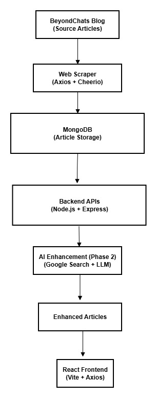

# BeyondChats-fullstack-assignment
Full Stack Web Developer Intern Assignment – Web scraping, AI-based article enhancement, and React frontend.
=======

This repository contains my submission for the Full Stack Web Developer Intern assignment at BeyondChats.  
The project is implemented in multiple phases as per the assignment instructions.

---

## Tech Stack

- Backend: Node.js, Express.js  
- Database: MongoDB  
- Web Scraping: Axios, Cheerio  
- AI / LLM: Ollama (phi3 – local LLM)  
- API Testing: PowerShell (Invoke-RestMethod)  
- Frontend: ReactJS (Vite)  
- Tools: MongoDB Compass  

---

## Phase 1: Web Scraping & CRUD APIs

### Objective
- Scrape the oldest articles from the BeyondChats blog.
- Store the scraped articles in a database.
- Create CRUD APIs to manage the articles.

### Implementation Details

1. **Web Scraping**
   - Fetched the BeyondChats blog listing page using Axios.
   - Parsed HTML content using Cheerio.
   - Extracted the oldest available article links.
   - Scraped article title, content, and URL.

2. **Database Storage**
   - Stored scraped articles in MongoDB using Mongoose.
   - Verified stored data using MongoDB Compass.

3. **CRUD APIs**
   - Implemented RESTful APIs using Express.js:
     - `GET /articles` – Fetch all articles
     - `GET /articles/:id` – Fetch a single article
     - `PUT /articles/:id` – Update an article
     - `DELETE /articles/:id` – Delete an article
   - Verified CRUD operations using PowerShell commands.

---

## Phase 2: AI-Based Article Enhancement

### Objective
- Enhance scraped articles using external references and AI.

### Implementation Details

- Created a Node.js automation script.
- Fetched existing articles using Phase 1 APIs.
- Searched article titles using Google Search API (SerpAPI).
- Extracted top-ranking external blog articles.
- Scraped main content from external sources with fallback handling.
- Used a **local LLM (Ollama – phi3)** to enhance and reformat article content.
- Updated enhanced articles using existing CRUD APIs.
- Stored reference article URLs for proper citation.

> **Note:** AI processing time varies as a local LLM running on CPU is used for content generation.

---

## Phase 3: React Frontend

### Objective
- Build a frontend UI to display original and AI-enhanced articles.

### Implementation Details

- Built a ReactJS frontend using Vite.
- Fetched articles from backend REST APIs.
- Displayed both original and updated (AI-enhanced) article content.
- Implemented a responsive and professional UI.
- Completed the end-to-end workflow from scraping to AI enhancement to frontend display.

---


## Architecture Diagram




## System Architecture & Data Flow

The project follows a modular architecture:

1. The scraper fetches the BeyondChats blog page and extracts article data.
2. Scraped articles are stored in MongoDB using Mongoose.
3. Express.js APIs expose CRUD operations on stored articles.
4. A Phase 2 automation script enhances articles using Google search results and an LLM.
5. Updated articles are published back to the database via APIs.
6. A React frontend consumes APIs to display content.

### Data Flow

Blog Website → Scraper → MongoDB → Express APIs → Phase 2 Script → LLM → Updated Articles → React UI


---

## API Endpoints

| Method | Endpoint | Description |
|------|---------|-------------|
| GET | /articles | Fetch all articles |
| GET | /articles/:id | Fetch article by ID |
| PUT | /articles/:id | Update article content |
| DELETE | /articles/:id | Delete an article |

---

## How to Run Locally

### 1. Install dependencies
      ```bash
      npm install

### 2. Start MongoDB service
      net start MongoDB

### 3. Run scraper (Phase 1)
      node scraper/scrape.js

### 4. Start backend server
      node server.js

### 5. Run Phase 2 automation
      node phase2/enhanceArticles.js

### 6. Start frontend (Phase 3)
      cd frontend
      npm install
      npm run dev


## Frontend will be available at:

http://localhost:5173

## Conclusion

This project demonstrates a complete full-stack workflow involving web scraping, database management, RESTful APIs, AI-powered content enhancement, and frontend integration using modern web technologies.


### Live Frontend Demo

🔗 https://beyond-chats-fullstack-assignment-t-7a2a.vercel.app

The live frontend demonstrates:
- Original scraped articles
- AI-enhanced versions
- Reference citations

For demo stability, the frontend uses representative static data generated from the backend and AI pipeline.

